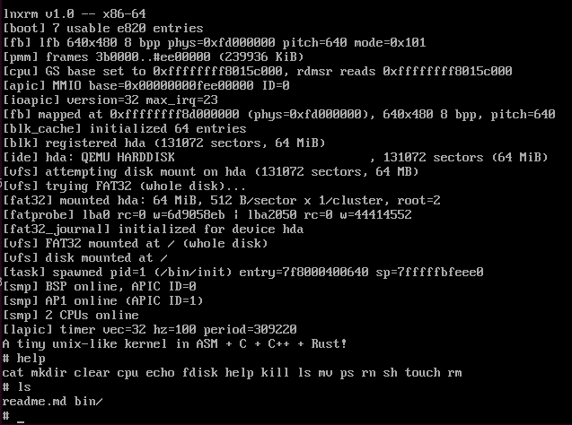

# lnxrm

> **A tiny unix-like kernel in ASM + C + C++ + Rust** — x86-64 · SMP



约 11k 行的从零编写的类 Unix 内核：C 为主体，C++ 负责 SMP/AHCI，Rust 负责串口驱动与同步原语，启动/中断/上下文切换用 NASM 汇编。

## 特性

- **启动**：符合 Linux x86 boot protocol 2.08 的 `bzImage`，支持 QEMU `-kernel` 与 GRUB `linux` 双路径
- **内存**：buddy 物理页分配器、分离空闲链内核堆、每进程 PML4（slot 0 恒等映射 / 255 用户 / 511 高半区别名）
- **多核**：`INIT-SIPI-SIPI` 拉起 AP，每 CPU 独立 GDT/IDT/TSS/运行队列，抢占式 round-robin，最多 8 CPU
- **进程**：`fork` / `execve`（静态 ELF64）/ `wait4` / `brk`，32 个 POSIX 信号 + 用户态 trampoline
- **中断**：LAPIC + IOAPIC（弃用 8259），PS/2 键盘、16550 UART（Rust）、VBE 帧缓冲控制台（ANSI）
- **存储**：PCI 枚举、IDE (PIO) / AHCI (DMA) 驱动、VFS + FAT32（含 journal）+ LRU 块缓存
- **用户态**：34 个 `int 0x80` 系统调用，自带 `crt0`/`ulib`，内置 `sh` `ls` `cat` `ps` `mv` `mkdir` 等 17 个命令

## 构建

```bash
make        
make run    
make clean
```
